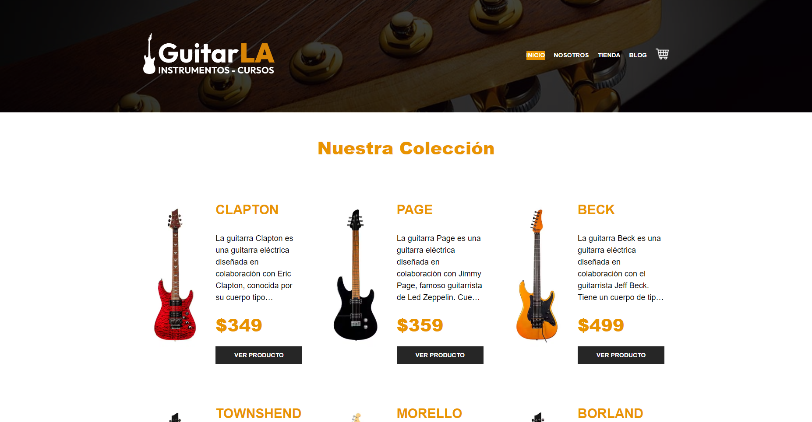

# Welcome to GuitarLA-Next 👋

[](#)

> Proyecto realizado con Next, respecto a una tienda de guitarras, con un carrito de compras.


### ✨ [Demo](https://guitar-la-proyect.vercel.app/)

## Install

```sh
yarn install
```
## Dev

```sh
npm run dev
# or
yarn dev
# or
pnpm dev
```

## Usage

```sh
yarn run start
```

## Pages
- ***index:***Muestra la homepage de la pagina, donde se muestra una combinación del blog y tienda de la pagina.
- ***blog:***Muestra blogs con información referente a guitarras.
- ***carrito:***Muestra todos los articulos guardados para su compra.
- ***nosotros:***Muestra información relevante a la pagina.
- ***tienda:***Muestra todas las guitarras que estan en venta.

## Author

👤 **Marcos Alanya**

* Website: https://portafoly-site.netlify.app
* Github: [@MarcosAlanya19](https://github.com/MarcosAlanya19)
* LinkedIn: [@marcosalanya19](https://linkedin.com/in/marcosalanya19)
